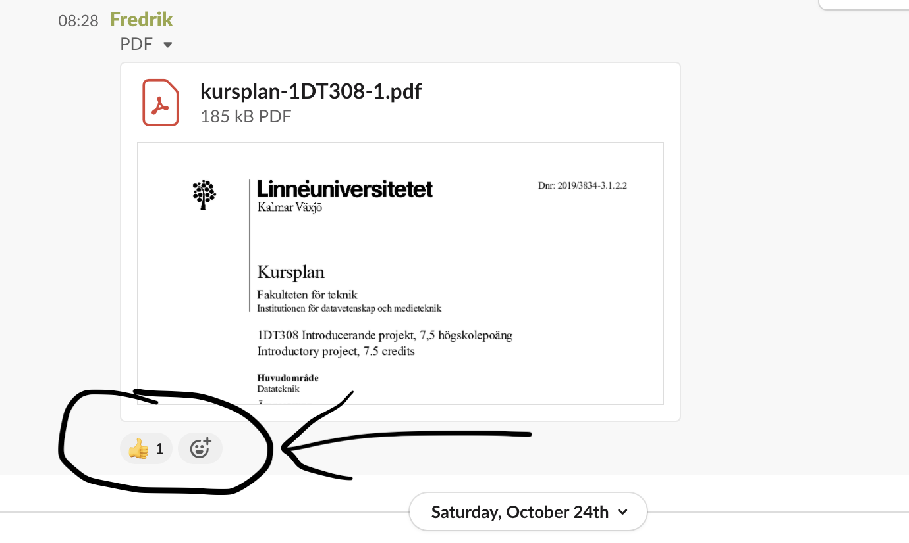

# Studieguide 1DT308 / 1DT902

[Inspelning av denna studieguide](https://youtu.be/)
{youtube }

## Viktiga länkar

- [Moodle]()
- [IoT tutorial template](https://hackmd.io/@lnu-iot/iot-tutorial)
- [Planning](https://hackmd.io/@lnu-iot/planning)
- [Kursplan 1DT308](https://kursplan.lnu.se/kursplaner/kursplan-1DT308-1.pdf)
- [Kursplan 1DT902](https://kursplan.lnu.se/kursplaner/kursplan-1DT902-1.pdf)
- [Gitlab](https://gitlab.lnu.se)
- [Slack kanal](coursepress.lnu.se) **#1dt308-1dt902-introducerande-projekt**

## Förväntningar

- Läs detta dokumentet **noggrant**. Återkoppla med kommentarer direkt om det är något som är oklart.
- Planera dina studier. Lägg in tid i din kalender för att se/lyssna på inspelat material, närvaro på workshops och för uppgifter.
- Fråga gärna dina frågor tidigt om något är oklart, vänta inte. Påbörja uppgifter i god tid, annars finns mycket litet utrymme för att hinna hjälpa.
- **Interagera med studenter och lärare på Slack**. Fråga, och var inte rädd att svara på frågor från andra studenter. Kom ihåg - var trevlig och respektfull. Kursens framgång bygger på er medverkan.
- Framförallt - försök anamma en positiv inställning och **ha kul.**

## Mål

Kursen har två spår. Det första spåret presenterar en enkel enchipsdator och hur man kan skriva program som interagerar med externa enheter såsom sensorer och nätverkskopplade enheter. Inom det andra spåret introduceras hur man arbetar i projekt och grupp, samt yrkesrollen ingenjör.

- Introduktion till en enchipsdator (hårdvara och mjukvara).
- Implementera och exekvera program i Python på en enchipsdator.
- Interagera med externa enheter (såsom sensorer och nätverkskopplade enheter).
- Fördjupningavlabbmiljön.
- Introduktion till kravhantering, mjukvarudesign och testning.
- Introduktion av verktyg och metoder som används inom ett projekt såsom versionshantering, kravhantering, och kommunikation.
- Introduktion till projektmetodik och projektdynamik.
- Hur man arbetar i grupp, vilka roller som finns, vilket ansvar individen har, osv.
- Hur man söker efter information om mjukvaruutvecklings problem, såsom APIer, hårdvaruspecifikationer och lösningar till problem som uppstår. l Hur man skriver enklare projektdokumentation.
- Muntlig och skriftlig presentation av tekniskt material.
- Ingenjörens yrkesroll, arbetsuppgifter och förhållningssätt.
- Ingenjörens ansvar och arbetsmiljö.

## Kommunikationsstrategi

- *Personliga* frågor gällande formella medverkan på kursen, frånvaro, betyg skickas via email till ansvarig lärare. OBS, undvik gärna mail.
- Frågor kring kursen, uppgifter, examination, schema, ställs i Slack **#1dt308-1dt902-introducerande-projekt**.
- Information gällande kursen kommer postas på Slack. Det är _viktigt_ att du läser allt som är '*Pinned*'.
- Reagera till **alla** '*Pinned posts*' på Slack.
- Ni kan filtrera alla '*Pinned posts*' enligt figur nedan.

## Kursmål

| Kursmål			| Uppgift |
| :---: | :---: |

## Deadlines

Kursen börjar **måndagen den 2:e november 2020** och slutar **fredagen den 15:e januari 2021**.

Samtliga moment ska vara genomförda innan kursens slut för ett betyg.

## Examination

| Benämning | Betygsskala | Poäng |
| --- | --- | --- |
|  Programmeringsuppgifter  | U/G | 2 |
Projekt (inkl. leverabler)
Presentation
Uppgifter om yrkesrollen ingenjör

- Projektarbetet, en [**Tutorial**](https://hackmd.io/@lnu-iot/iot-tutorial) som beskriver ditt projekt.
- Aktivt deltagande på laborationer.

---

| Grade |  T1  |  T2  | Public report | Quiz | Complexity level | Presentation / Demo video | Active participation |
|:-----:|:----:|:----:|:-------------:|:----:|:--------------:|:----------:|:--------------------:|
|   A   |  x   | 100% |       x       |  x   |      3        |     x      |         very high            |
|   B   |  x   |  90% |       x       |  x   |      2        |     x      |          high           |
|   C   |  x   |      |               |  x   |      1        |            |         moderate            |
|   D   |  x   |      |               |  x   |       1        |            |         moderate            |
|   E   |  x   |      |               |  x   |       1        |            |       low            |
|   Fx  | part |      |               | part |       1        |            |       low            |
|   F   |      |      |               |      |                |            |                      |

**OBS! Om ni önskar ett högre betyg än C** måste ni presentera och diskutera ert projekt med lärare, samt anmäla intresse för högre betyg.

För att kunna få högre betyg än C krävs en enskild rapport på nivå **T2** och göra den öppen tillgänglig, till exempel på hackmd.io. För ett högre betyg krävs också ett aktivt deltagande och samarbete på Slack. T2 innebär en mer avancerad [rapport](https://hackmd.io/@lnu-iot/iot-tutorial), där det krävs att du fullföljer alla uppgifter (alla checkboxes utförligt) med gott resultat, samt ett aktivt deltagande och öppen publicerad tutorial.

Profilprojekt (dvs med högre betyg A och B) kommer att sammanställas och presenteras som [goda exempel](https://hackmd.io/@lnu-iot/good-examples). Ni hittar en mall och instruktioner för slutrapporten på denna sida:
[Slutrapport, tutorial template](https://hackmd.io/@lnu-iot/iot-tutorial)

## Planering

Kursen är tio veckor lång, varav de fyra första veckorna innehåller mer grundläggande föreläsningar och laborationer för att komma igång med hårvara. 

Vi kommer att publicera alla öppna inspelningar på vår [Youtube .. update here](), följ gärna den.