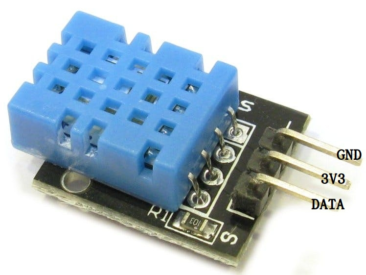
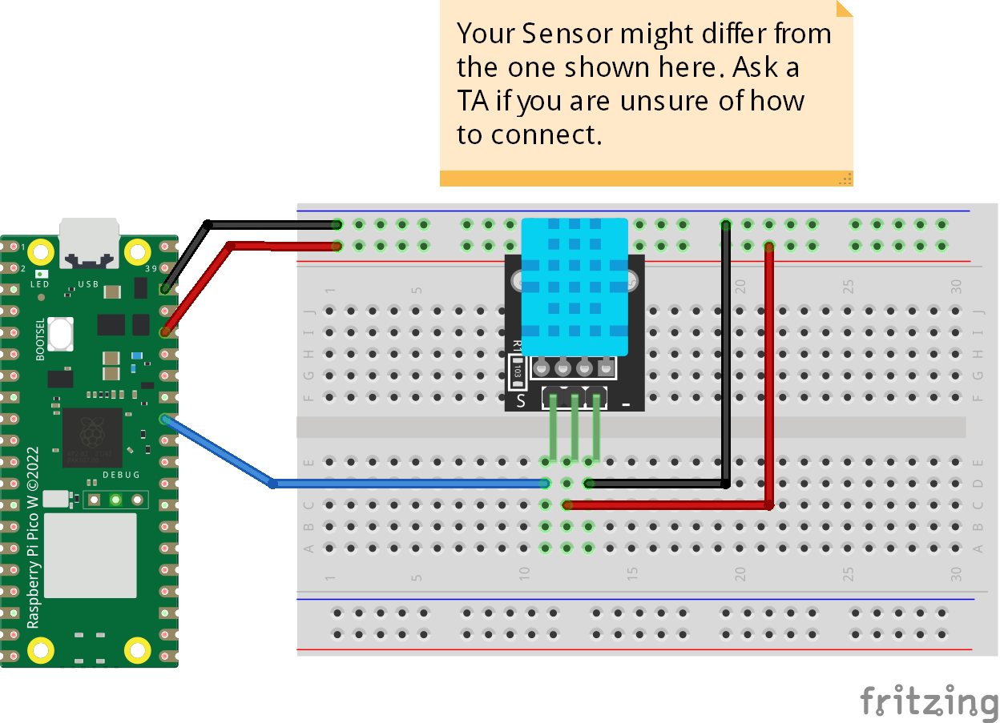

# Lab 1 - Getting started and Hello World with LED


In this course, we are going to use microcontrollers programmed with MicroPython. The controllers are considered as an IoT device or 'IoT thing'.

In the labs for this course, we are first going to get started with the hardware, and then later on controlling some lights and reading digital inputs. Later on, you will also read a sensor value and transmit that to an online service. In the basic lab setup we are only going to use USB and WiFi as our interfaces. We are in the basic labs using the Raspberry Pi Pico Wireless, and it has WiFi, Bluetooth and is based on the RP2040 chipset. The main advantage of using MicroPython compared to C++ and Arduino IDE is that we can quickly test and run our code without compiling and flashing. It makes the development much faster and easier.

### Reference:

**A really good guide on getting started with RPI Pico W: https://projects.raspberrypi.org/en/projects/get-started-pico-w**

**Raspberry Pi Pico W Pinout: https://datasheets.raspberrypi.com/picow/PicoW-A4-Pinout.pdf**


### Analog to Digital
In the schematic, you might first look at the Analog Pins called ADC#. ADC stands for Analog to Digital Converter - and it takes an input signal from your sensor and converts it to a digital representation - something the computer can work with.

The difference between analog and digital is that analog signals vary, they go anywhere between 0 and some other voltage, for example, 3.3V (or 5V); while digital signals are either 0 or that voltage - which means they are binary, low or high voltage - or in computer language, 0 or 1 (false or true).

Your computer works in binary, that's why we need an analog-to-digital converter to work with the signals. We will show how to use them in this tutorial.

### General Purpose Pins
As you might note all PINs that start with GP# are General Purpose Input/Output (GPIO) Pins and they can be connected to the sensors and be used by the Pin() method in MicroPython code.


You will need to flash the Pico W with MicroPython firmware. You can find the firmware here: https://micropython.org/download/rp2-pico-w/

* Note: There are daily nightly builds on the website. If you stumble on problems try another version.

The firmware is easily flashed to the microcontroller by holding the BOOTSEL button, the microcontroller will then show up as a USB drive. Copy the firmware to the drive and the microcontroller will reboot and start running MicroPython. There is also a possibility to flash firmware using the Thonny IDE, but that is not recommended as you will end up with the Pico firmware (not the Wireless).

If you're running a Mac and have problems with copying the UF2 file to the Pico W (*Error 100093*), you can use the following command in the terminal: `rsync /path/to/firmware.uf2 /Volumes/RPI-RP2/`


## Introduction

 * Upload files and run code on the microcontroller

## Rules
This task is going to be conducted individually.

## Ingredients

### Hardware
 * One Pico W board
 * One Micro-USB-Cable
 * Your computer

### Software
 * **Thonny** programming environment, https://thonny.org/
 
### Knowledge components

 * configure your IDE
 * run code in the REPL https://docs.micropython.org/en/latest/reference/repl.html
 * upload and run code in files
 * print() strings to console https://www.w3schools.com/python/ref_func_print.asp
 * import statements http://wiki.micropython.org/Importing-Modules
 * for-loops with `range()` https://www.w3schools.com/python/python_for_loops.asp
 * `time.sleep()` https://docs.micropython.org/en/latest/rp2/quickref.html#delay-and-timing

## Steps
Complete each step before progressing to the next.

### Step 1. Hardware setup

WARNING! "**Be gentle on hardware** when plugging and unplugging from the USB connector. Whilst the USB connector is soldered and is relatively strong, if it breaks  it can be very difficult to fix."

### Step 2. Software setup

### Step 3.
Make sure the board is connected to a computer with your IDE. When the board is properly setup you can run micropython code directly on it using the IDE. The output from the commands are sent to the computer so that you can interact with the board.

Write help() in the console and press enter, this should give you output like in "Expected output 1"
```python
>>>help()
```

The help command prints some useful short-cuts you can use to for example interrupt a board that is stuck in a loop so that you can upload new code.

#### Expected output. Run help() on board


### Step 4. Run custom code on the board
Create project folder in your IDE, with a main.py file and run it.

Using the IDE, create a new file (main.py) with the following content but replace "Name" with your username.

```python
print("Hello, Name!")
```

Press the green run button


When pressing the Run button you are executing the code in the text editor on the microcontroller. It's essentially the same as you would have written everything line by line in the REPL console. Make sure that you either edit the code on your computer and then upload the files to the device, or if you are working with editing files directly on the device.

When the microcontroller starts it first executes the file `boot.py` and then `main.py`. If you want to run other files you can do so by importing them in `main.py` or by running them directly in the REPL console.

When the has completed the code will run on the board and should produce the same output as in Expected output 2.

#### Expected output 2.


When you have completed this assignment you are expected to know:
 * How to flash firmware on your microcontroller.
 * How to setup your IDE.
 * How to run python commands using the REPL console.
 * How to upload and run code

This task is examined using self-examination. Make sure you understand every step before you proceed.

# Lab 0. Hello World of IoT

### Blink Lights

### Knowledge components
* Make the thread sleep for a second  python  time.sleep(seconds) 
* Loops. python  while Condition:  and/or python  for element in array: 

### Follow a tutorial and modify code, blink a light.

Find a tutortiol that shows how to blink the on board LED.

### Expected output:

The on board LED is on for two seconds, and off for three seconds repeatedly.

# Blink External LEDs

## Introduction
In this assignment, we connect basic circuits with LED's on a breadbord and write python code that turns these on and off.

 * Get LED-lights to blink.
 * Work with GPIO ports.
 * Python loops
 
## Rules

This task is going to be conducted individually.

## Ingredients

### Hardware
 * 1 breadboard
 * 1 Red LED
 * 1 Yellow LED
 * 1 Green LED
 * 3 Resistors \~400 Ohm (Green, Blue, Brown, Gold) or higher
 
### Software 
 * IDE of your choice (preferably Thonny)

### Knowledge components
 * Breadboards (kopplingsdäck) https://learn.sparkfun.com/tutorials/how-to-use-a-breadboard/all
* Basic LED circuit https://en.wikipedia.org/wiki/LED_circuit
* Light Emitting Diodes (LEDs) https://en.wikipedia.org/wiki/Light-emitting_diode
* Resistors (motstånd) https://en.wikipedia.org/wiki/Resistor
 * Microcontroller GPIO https://en.wikipedia.org/wiki/General-purpose_input/output
* Make a GPIO port an output https://docs.micropython.org/en/latest/rp2/quickref.html#pins-and-gpio
* Turn GPIO output on and off. ```python pin.value([value]) ```
* Make the thread sleep for a second  ```python  time.sleep(seconds) ```
* Loops. ```python  while Condition: ``` and/or ```python  for element in array: ```

## Steps

### Step 1. Connect Three LED circuits

We are going to connect three LED circuits on the breadboard and power these from the GND(-) and 3V3(+) connections on the MCU. See breadboard tutorial if needed.
**WARNING! When changing components on the breadboard, always have the USB disconnected!**

 * Disconnect the USB cable. 
 * Connect the GND to the black/blue power rail (BPR) on the breadboard. Also connect 3V3 to the red power rail (RPR). 
 * Connect the three LED circuits but use the power rails as + and - of the battery and use a 560 Ohm resistor. 
 * Make sure each LED lights up when you connect the USB-cable. 
 * Make sure you use suitable GPIO pins. Read the documentation for the Pico W. https://datasheets.raspberrypi.org/pico/pico-datasheet.pdf
 
#### Connections 
Summary of connections. "<-->" means a cable or connection
 * MCU GND <--> Black/Blue Power Rail (BPR)
 * MCU 3V3 <--> Red Power Rail (RPR)
 * RPR(3V3) <--> [ Anode - LED - Cathode ] <--> [ resistor ] <--> BPR(GND)
 
 


### Step 2. Driving LED with GPIO  

IMPORTANT: We are going to connect external LED's to the microcontroller. The MCU microcontroller provides "General Purpose Input Output"-ports also called GPIO-ports that can be used to communicate with external components. The ports are a bit sensitive and should not be used to directly drive heavy loads (like a motor). The Datasheet for MCU says "Absolute MAX per pin 16 mA" which means we must reduce current by using resistors. If more current is needed, additional components (eg. transistors, or drivers) can be used. Thankfully this assignment does not require high current and we can reduce the current flow by having a resistor in series with each LED we connect.

 * Disconnect the USB cable again
 * For each of the LEDs, remove the wire going from the red power rail to the anode (but keep the GND cable and resistor).
 * Introduce new cables going from GPIO ports on the MCU to the LED anodes as in connections below.
 
 #### Connections 
 * MCU GND <--> Black Power Rail (BPR)
 * MCU P8 <--> [ Anode - Red LED - Cathode ] <--> [ 560 Ohm resistor ] <--> BPR(GND)
 * MCU P9 <--> [ Anode - Yellow LED - Cathode ] <--> [ 560 Ohm resistor ] <--> BPR(GND)
 * MCU P10 <--> [ Anode - Green LED - Cathode ] <--> [ 560 Ohm resistor ] <--> BPR(GND)
 
#### Expected output

The Red LED should be ON after the MCU has booted, should stay ON one second, and turn off. The behaviour is repeated if the board is reset by pressing the reset button on the MCU board (next to the RGB-LED on the side of the micro-USB.

### Driving multiple LED's with GPIO

Now adjust the code so that all three LED's blink like this:
 * RED lights up for 1 second. Other LEDs are unlit.
 * GREEN lights up for 1 second. Other LEDs are unlit.
 * YELLOW lights up for 1 second. Other LEDs are unlit.
 * Repeat forever with RED again

#### Expected output
[](http://www.youtube.com/watch?v=Wtd8pp-DW3w "")


# DHT11 Temperature and Humidity Sensor


In this part, we are going to work with temperature and humidity sensor DHT11.

The DHT11 is a digital sensor measuring temprature and humidity. Raspberry Pi Pico W MicroPython has a builtin library for this sensor so you do not need to import an extra library when you write code to read its values. As you can see it the following image there are different pin settings for DHT11 based on the manufacturer. If you have one like in the left part you can recongized the pin by the sign beside each. GND presented usually by (-), VCC by (+), and Data Pin by (S). So please double check before connecting your sensor to the Raspberry Pi.




You can find DHT example in [LNU GitHub](https://github.com/iot-lnu/applied-iot/tree/master/Raspberry%20Pi%20Pico%20(W)%20Micropython/sensor-examples/P5_DHT_11_DHT_22). 

The connection looks like the following figure but always check your sensor pin setting first to make sure they match.




<span style="color:red;">⚠️IMPORTANT⚠️</span>

- Disconnect the power/USB cable from the Development/Expansion board before connecting sensors or changing a sensor pin. This allows us to check that everything is correct before powering the board.
- Always check if the sensor works on 5V or 3.3V before connecting your sensor to the board. If you are unsure, check the sensor datasheet or consult it with a TA.
- We recommend using colored wires to make it easier to distinguish which wires are which.
- We recommend using a breadboard if you have several sensors; it makes the connection more visible.


## Example Code

You find a sample code below which can be copied to your main.py and test your dht11.


```python
import dht                 # import the builtin library
from machine import Pin    # library for pin access      
import time                # library for making delays between reading

tempSensor = dht.DHT11(Pin(27))     # DHT11 Constructor 

while True:
    try:
        tempSensor.measure()
        temperature = tempSensor.temperature()
        humidity = tempSensor.humidity()
        print("Temperature is {} degrees Celsius and Humidity is {}%".format(temperature, humidity))
    except:
        print("Error in reading sensor values")
    time.sleep(2)
```

## Examination

This assignment should be examined by a teacher/TA. 

Prepare for that by checking yourself so that you know the answers to the following questions:

 * Which leg (pin) of the LED is longer, the cathode or the anode?
 * How to blink the built-in LED?
 * Why do we need a resistor in series with each LED?
 * How can we make the LEDs blink faster?
 * Where can you find information about the different hardware limits in the MCU board?
 * What are the components of a basic LED-circuit and how do we connect them in order for the LED to be ON?
