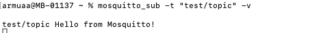
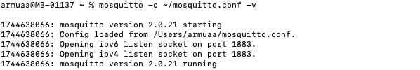
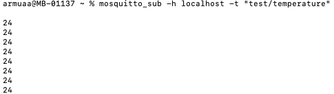
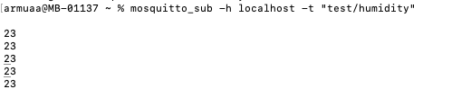
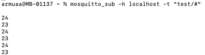
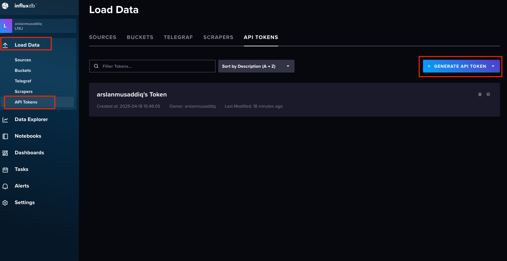
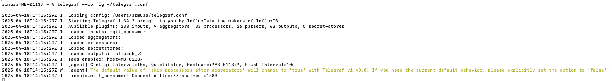
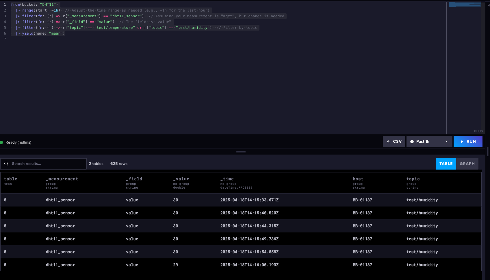
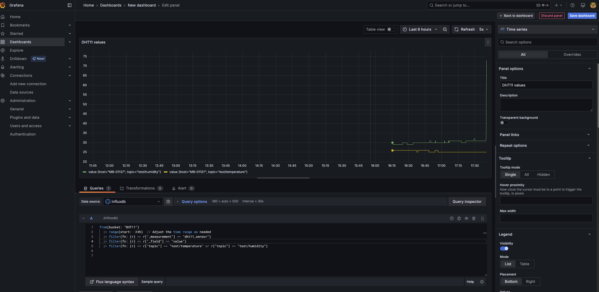

# Lab 2 - Visualizing IoT Sensor Data using TIG Stack

In this lab, you will build a local or networked IoT data pipeline using the **TIG stack**:

- **Telegraf** to collect and parse MQTT data  
- **InfluxDB** to store the time-series data  
- **Grafana** to visualize the sensor values (Temperature & Humidity)

We will publish data using **Raspberry Pi Pico W** over MQTT, and then collect, store, and visualize it.

## Objectives

- Set up a TIG stack on your local machine.
- Connect Telegraf to your MQTT broker (Mosquitto) and configure it to collect sensor data.
- Store incoming temperature and humidity readings in InfluxDB.
- Use Grafana to build a real-time dashboard to display the data.

## Overview

The Raspberry Pi Pico W will read values from a **DHT11 sensor** and send them over MQTT.  
Telegraf will act as the MQTT subscriber and forward the readings to InfluxDB.  
Grafana will pull the time-series data from InfluxDB and visualize it in a dashboard.

# Step 1: Set Up MQTT Broker (Mosquitto)

In this first step, we will set up our own local MQTT broker using **Mosquitto**, which will facilitate communication between the Raspberry Pi Pico W (with the DHT11 sensor) and our local network.

We are not using Adafruit IO in this setup because we prefer to manage the broker locally. 

## What is Mosquitto?
**Mosquitto** is an open-source MQTT broker that enables devices to communicate using the MQTT protocol. It allows devices (like your Raspberry Pi Pico W) to publish sensor data, and other applications (like Telegraf) to subscribe to those data streams.

## Why Use Mosquitto?
- **Full Control**: By setting up Mosquitto locally, you have full control over your MQTT communication.
- **Local Setup**: No need to rely on external cloud services (e.g., Adafruit IO) for communication.
- **TIG Stack Compatibility**: Mosquitto integrates seamlessly with Telegraf to collect and send data to InfluxDB.

## Instructions to Install Mosquitto

### Instructions to Install Mosquitto on macOS

### Option 1: Install Mosquitto Using Homebrew (macOS)
If you are using **macOS**, you can install Mosquitto using **Homebrew**:

1. **Install Homebrew**:
   If you don't already have Homebrew installed, open the Terminal and run the following command to install it:
  
```bash
  /bin/bash -c "$(curl -fsSL https://raw.githubusercontent.com/Homebrew/install/HEAD/install.sh)"
```
2. **Install Mosquitto**:

After Homebrew is installed, run the following command in your terminal to install Mosquitto:

```bash
brew install mosquitto
```

3. **Start Mosquitto**:
Once installed, you can start the Mosquitto broker by running:

```bash
brew services start mosquitto
```

This will start Mosquitto as a background service. To ensure it's running, use:

```bash
brew services list
```

This should show that Mosquitto is running.

3. **Test**:

Subscribe to a Topic (Terminal 1):


```bash
mosquitto_sub -t "test/topic" -v
```

Publish a Message to a Topic (Terminal 2):

```bash
mosquitto_pub -t 'test/topic' -m 'Hello from Mosquitto!'
```

If everything is set up correctly, Terminal 1 should display the message "test/topic Hello from Mosquitto!".




# Step 2: Set up MQTT client for Mosquitto on Raspberry Pi Pico W

Instead of using Adafruit IO, you will use the Mosquitto broker you set up on your MacBook.

1. **Install the MQTT library (umqtt.simple) on your Raspberry Pi Pico W using**:

from umqtt.simple import MQTTClient

2. **Configure MQTT Credentials**:

You need to use the Mosquitto broker's address and port (usually localhost and 1883), but since your Raspberry Pi Pico W is on a different network, you will need to use the IP address of the MacBook where Mosquitto is running.

Update your MQTT credentials:

# Mosquitto broker details
```bash

MQTT_BROKER = "192.168.x.x"  # Replace with your MacBook IP address
MQTT_PORT = 1883  # Default MQTT port
MQTT_CLIENT_ID = "pico_w_sensor"  # Unique ID for the client
MQTT_TEMP_TOPIC = "test/temperature"  # Topic for temperature data
MQTT_HUMIDITY_TOPIC = "test/humidity"  # Topic for humidity data

```

You need to edit the Mosquitto configuration to allow remote devices (like Pico W) to connect.

By default, Mosquitto doesn’t load any config unless specified'

run 

```bash
nano ~/mosquitto.conf
```

Paste this into the file:

```bash
listener 1883
allow_anonymous true
```

Now run Mosquitto using your new config:

```bash
mosquitto -c ~/mosquitto.conf -v
```
You should see something like:




Find your Mac’s IP address:

```bash
ipconfig getifaddr en0
```

Update Pico W Code

Open a new terminal and run:

```bash
mosquitto_sub -h localhost -t "test/temperature"

```
You will see temperature values like this: 




In another terminal:

```bash
mosquitto_sub -h localhost -t "test/humidity"

```
You will see humidity values like this: 



Or you can subscribe to all topics with:

```bash
mosquitto_sub -h localhost -t "test/#"

```

you will see this output




# Step 3: Set up a TIG Stack

The next step is to hook this up with the TIG stack to visualize the data. 


## Install InfluxDB on macOS

InfluxDB is your time-series database where sensor data will be stored.


 Install via Homebrew:

```bash
brew install influxdb

```
Start InfluxDB:

```bash
brew services start influxdb

```
Confirm it's running:

```bash
influx
```

If the influx CLI tool is not available in your terminal’s path yet, probably because you are using InfluxDB 2.x, or the path was not added automatically by Homebrew. In this case:

Check if InfluxDB is installed: 

```bash
brew list | grep influxdb

```
If it is installed, find the version: 

```bash
brew info influxdb

```

If you installed InfluxDB v2.x, you have to initialize it first

```bash
influxd
```

Now open a new terminal tab and set it up:

```bash
influx setup

```

It will prompt you for:

- Username
- Password
- Organization name
- Bucket name (this is like a database)
- Initial token

If it does not include the CLI (influx) tool by default. You might get the command not found: influx error.

For this, install 

Install the influx CLI
```bash
brew install influxdb-cli

```

This will give you the actual influx command that lets you talk to the server.

Once the CLI is installed, start the InfluxDB server (it doesn’t auto-run by default):

```bash
brew services start influxdb

```

Now in a new terminal tab, run:

```bash
influx setup

```

If your Influx DB is installed successfully, then lets setup a Telegraf to subscribe to Mosquitto and push data to InfluxDB. 


## Set Up Telegraf to Subscribe to MQTT and Send Data to InfluxDB


Telegraf collects data from Mosquitto and forwards it to InfluxDB.


### Install Telegraf

```bash
brew install telegraf

```

### Create Telegraf Config File
We are configuring it to:

- Use the MQTT consumer plugin

- Output to InfluxDB v2

- Subscribe to our test/temperature and test/humidity topics

Before configuring, we need to find InfluxDB API token, whih is a key that lets Telegraf write data into your InfluxDB bucket.

- Open http://localhost:8086 in your browser.
- Log in.
- Go to the "Load Data" tab on the left sidebar.
- Click on "API Tokens".
- You will see something like "Telegraf Token" or whatever name you gave it during setup.





Now create a config file (e.g., telegraf.conf) like this:


```bash
nano ~/telegraf.conf

```

and paste the following: 
```toml

[agent]
  interval = "10s"
  round_interval = true
  metric_batch_size = 1000
  metric_buffer_limit = 10000
  collection_jitter = "0s"
  flush_interval = "10s"
  flush_jitter = "0s"
  precision = ""
  debug = false
  quiet = false
  logfile = ""

[[outputs.influxdb_v2]]
  urls = ["http://localhost:8086"]
  token = "YOUR_TOKEN_HERE"
  organization = "YOUR_ORG_NAME"
  bucket = "YOUR_BUCKET_NAME"

[[inputs.mqtt_consumer]]
  servers = ["tcp://localhost:1883"]
  topics = [
    "test/temperature",
    "test/humidity"
  ]
  data_format = "value"
  data_type = "float"
  name_override = "dht11_sensor"
```

after configuring run the Telegraf using this:

```bash
telegraf --config ~/telegraf.conf

```

You should start seeing something like this: 




That means it’s reading from MQTT and writing to InfluxDB!


Run your query in data explore for example 


from(bucket: "DHT11")
  |> range(start: -1h)  // Adjust the time range as needed (e.g., -1h for the last hour)
  |> filter(fn: (r) => r["_measurement"] == "dht11_sensor")  // Assuming your measurement is "mqtt", but change if needed
  |> filter(fn: (r) => r["_field"] == "value")  // The field is "value"
  |> filter(fn: (r) => r["topic"] == "test/temperature" or r["topic"] == "test/humidity")  // Filter by topic
  |> yield(name: "mean")


  Ensure the measurement name, field name and topics are used correctly

This (above) query will retrieve all fields (value) from all measurements, filtered by the topic tags for temperature and humidity.

You should see something like this: 




## Visualize the Data with Grafana


It’s common to visualize time-series data to understand patterns and trends. You can do this in two main ways:

1. Use InfluxDB’s Data Explorer (Quick Visualizations), you can click on Graph and to review your data. 
or 

2. Use Grafana for Real-Time Dashboards

Grafana is a powerful tool that integrates seamlessly with InfluxDB, allowing you to create live, auto-refreshing dashboards. 

To set it up, do the following steps. 


- Install Grafana on your system.


```bash
brew install grafana

```

The default login credentials for Grafana are:

Username: admin

Password: admin


- Start Grafana

```bash
brew services start grafana

```

and go to your browser, open the following:


http://localhost:3000/login

It will ask for passwaord change. 

After that click on Connections on left hand side. 

In the data source section, search for InfluxDB and select it.


This will open the configuration page for the InfluxDB data source.

Select Flux as query language and paste your 


URL: Enter the URL of your InfluxDB instance (e.g., http://localhost:8086 or the IP of the machine running InfluxDB).

and write your InfluxDB Details
Your organization name, Token, bucket etc. 

Click on save and test and click on building a dashboard. 


Database: Enter the bucket name you have set in InfluxDB, e.g., DHT11.

HTTP method is GET, 

and leave rest of the things as default. 


- Add InfluxDB as a Data Source in Grafana:

now write the flux query, for example: 

from(bucket: "DHT11")
  |> range(start: -24h)  // Adjust the time range as needed
  |> filter(fn: (r) => r["_measurement"] == "dht11_sensor")
  |> filter(fn: (r) => r["_field"] == "value")
  |> filter(fn: (r) => r["topic"] == "test/temperature" or r["topic"] == "test/humidity")
  
  and you will be able to see something like this: 

