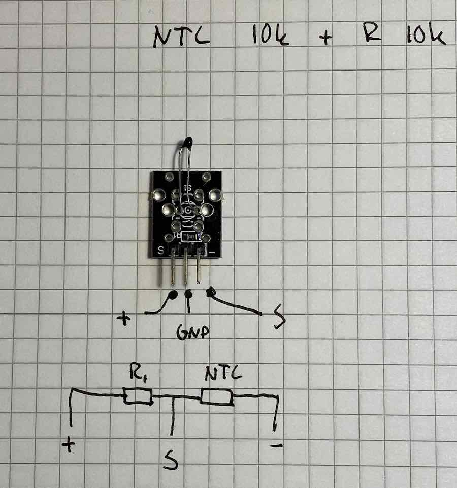
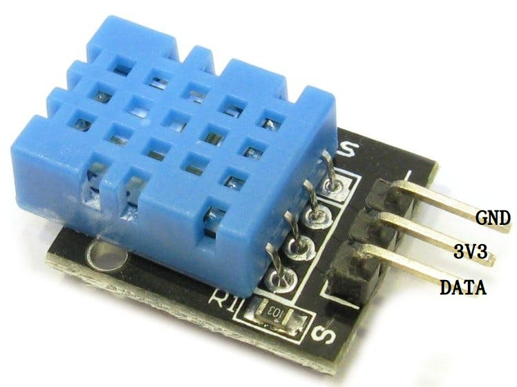

# Lab 2 - Using MQTT for IoT Communication


In this lab, we will learn how to implement MQTT (Message Queuing Telemetry Transport) for communication between IoT devices. MQTT is a lightweight messaging protocol designed for constrained environments like IoT. We will build a simple system where an MQTT broker facilitates communication between clients. Using a Raspberry Pi Pico W connected to a DHT11 temperature and humidity sensor and leds, we will read sensor values and transmit them to the MQTT broker. By the end of this lab, you will have a fundamental understanding of how to use MQTT to send sensor data over a network.


In this lab, we will use Adafruit IO, a cloud-based MQTT broker, to send and receive messages between IoT devices. 


## Objectives


- LED Control via Adafruit IO Dashboard: You will create a "Switch" block on your Adafruit IO dashboard, which will allow you to control the first LED. When the switch is turned on (via the dashboard), the Raspberry Pi Pico W will start sending temperature and humidity data from the DHT11 sensor to the MQTT broker.

- Sensor Data Transmission: When the LED is on, the Raspberry Pi Pico W will send the sensor data to the MQTT broker.

- LED Blinking on Data Transmission: With each time the sensor data is successfully sent, the second LED will blink briefly, indicating that the data transmission has occurred.

- Threshold-based LED Control: The system will monitor the sensor readings and check if they exceed a predefined threshold. If the temperature or humidity goes beyond this threshold, a third LED will turn on. If the values fall below the threshold, this LED will turn off.

## Rules

During this lab, you may discuss with students. You may help other students but you may NOT do all steps for them, or share any code. 

## Materials Needed:

- A computer with access to a code editor (e.g., Thonny).
- Internet connection for accessing MQTT resources. (You might need to use your phone Internet to connect Pico to WiFi)
- Python (for MQTT client-side implementation).
- MQTT Broker (Adafruit IO).
- MQTT Client libraries for Python (e.g., umqtt.simple).
- 3 LEDs.
- DHT11 temperature and humidity sensor.
- Jumper wires and resistors.

# Pre-Lab Setup  

## Create an Adafruit IO Account  

- Go to Adafruit IO and sign up for an account:  
  https://io.adafruit.com/  
- After signing up, you will have access to the dashboard where you can create "feeds" and "dashboards".  

## Create a Feed in Adafruit IO  

- In your Adafruit IO dashboard, create a feed (for example, "temperature") where data will be published.  
- This feed will be used as the topic for MQTT communication.  

## Generate an Adafruit IO Key  

- In your account settings, generate an **Adafruit IO Key**.  
- This key is necessary for authenticating the MQTT client to interact with Adafruit IO.  

## Install MQTT Python Library (umqtt.simple)  

You will need the umqtt.simple Python library to interact with the MQTT broker.

Install the library via the terminal or command prompt with the following command:

bash

pip install umqtt.simple


##  Connect the Hardware

- Connect the DHT11 sensor to your Raspberry Pi Pico W.
- Connect the three LEDs to the microcontroller: one for control, one for sending data, and one for alerting based on thresholds.
- Refer to your microcontroller’s pinout diagram to connect the components.


## Code Components
- Event callback functions for handling asynchronous events.
- Use global variables to manage state.
- Publish and Subscribe mechanisms in MQTT.
- Use timers for scheduling tasks.


 ### Breadboard circuit

Connect the breadboard power-rails to GND and 3V3.

 * GND <--> Black/Blue Power Rail (BPR)
 * 3V3 <--> Red Power Rail (RPR)
 
## Expected output

The program output should look like the following:


You Adafruit dashboard should look like this: 


#### Expected output

[](https://youtu.be/65yiLbLtZzU "")

https://i3.ytimg.com/vi/65yiLbLtZzU/maxresdefault.jpg
https://youtu.be/65yiLbLtZzU

### Step 2. Press play for music

The following code is from https://forum.pycom.io/topic/802/example-pwm-mariobros

Rewrite the code so that the music is started when the button is pressed. Merge with code from step 1 so that button can still be pressed.
 * The playing of the tune should not be run in the event handler. The event handler interrupts the currently running code on the microcontroller and thus locks up the execution until its done. To many interrupts may cause the microcontroller to be unresponsive. 
 * Keypresses that happen during the playing of the tune should not result in cued up plays. 
 * You may reduce the length of the Tune, but it must be longer than the time for contact bounce. 


```python

from machine import Pin
from machine import PWM
import time

# define frequency for each tone
E7 = 2637
F7 = 2794
C7 = 2093
G7 = 3136
G6 = 1568
E6 = 1319
A6 = 1760
B6 = 1976
AS6 = 1865
A7 = 3520
D7 = 2349

# set up pin PWM timer for output to buzzer or speaker
p2 = Pin("PXX")  # Pin Y2 with timer 8 Channel 2
tim = PWM(0, frequency=300)
ch = tim.channel(2, duty_cycle=0.5, pin=p2)https://forum.pycom.io/topic/802/example-pwm-mariobros

mario = [E7, E7, 0, E7, 0, C7, E7, 0, G7, 0, 0, 0, G6, 0, 0, 0, C7, 0, 0, G6, 0, 0, E6, 0, 0, A6, 0, B6, 0, AS6, A6, 0, G6, E7, 0, G7, A7, 0, F7, G7, 0, E7, 0,C7, D7, B6, 0, 0, C7, 0, 0, G6, 0, 0, E6, 0, 0, A6, 0, B6, 0, AS6, A6, 0, G6, E7, 0, G7, A7, 0, F7, G7, 0, E7, 0,C7, D7, B6, 0, 0]

for i in mario:
    if i == 0:
        ch.duty_cycle(0)
    else:
        tim = PWM(0, frequency=i)
        ch.duty_cycle(0.5)

    time.sleep(0.15)
```

## Step 3. Blink lights to tune

Assign one LED for each tone (multiple tones can be attached to the same LED) turn on LED's in tune with the music.

## Step 4. Read an analog temperature sensor

Read the analog value from the NTC-sensor and present it in time intervals to the console with a `print()`-function. Note, depending on your sensor you might need to do a voltage divider. Read more about NTC thermistors and how to connect a voltage divider here: https://www.electronics-tutorials.ws/io/thermistors.html

You will have to think about how the voltage that is read using the analog input is translated to a temperature. There are both [equations](https://eepower.com/resistor-guide/resistor-types/ntc-thermistor/#) and [lookup tables](https://cdn-shop.adafruit.com/datasheets/103_3950_lookuptable.pdf) that can be used to write a function.


**NOTE** The NTC thermistor mounted on a PCB that is distributed from the lab can be incorrectly marked. The correct setup is shown in the Figure below. If that does not give you expected values, try to switch the wires around, some students have found units that are incorrectly marked in different ways. [Analog temperature sensor NTC Electrokit](https://www.electrokit.com/uploads/productfile/41015/41015732_-_Analog_Temperature_Sensor.pdf) Note. The schematics are wrong on this one.



Discuss how accurate the reading is and the range of the temperature span that is presented.

- How many bits do you have for the value, and how does this affect your reading?

## Step 5. Read a digital temperature and humidity sensor

Connect a temperature and/or humidity (DHT11 / 22 or a DS18B20) sensor to the device. The sensor communicates using the 1-Wire protocol, you will need to use a library.

[Digital temp sensor DHT11 bought from Electrokit](https://www.electrokit.com/uploads/productfile/41016/DHT11.pdf)



## Examination

This assignment should be examined by a teacher/TA. 

You should in this assignment make sure you have fulfilled all the described tasks above. That is, you must be able to demonstrate reading both analog and digital sensors as well as interacting with buzzers and buttons.

Prepare for that by checking yourself so that you know the answers to the following questions:

 * What is the difference between a pull-up and a pull-down button circuit?
 * What is contact bouncing and why would we be bothered?
 * What is a microcontroller interrupt?
 * Why should we keep the code in event-callbacks to a minimum?
 * How can the song continue while the event-callback prints out key-presses?

When completed you should ask a teacher/TA to check your setup and verify the questions above yourself.

### Test setup:
 * The time for key-presses should be printed as the example.
 * Test by "spamming" the button with lots of short presses. The song should start on the first press and continue without interruption until it ends. The buttonclicks do not stack and after the song is over id does not restart unless a new click is introduced afterwards. The printouts of times should continue while the song is played.
 * If lights blink in tune with music, make extra credit note. 
 
### Check Code:
 * Code should be DRY (no unnecessary repeated statements)
 * Code should be divided into methods
 * The song should not be played in the eventhandler function but started in a separate loop (or thread).
