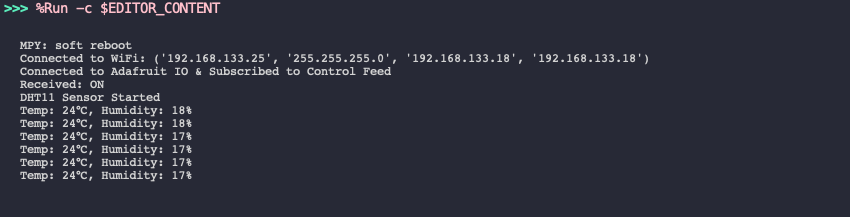
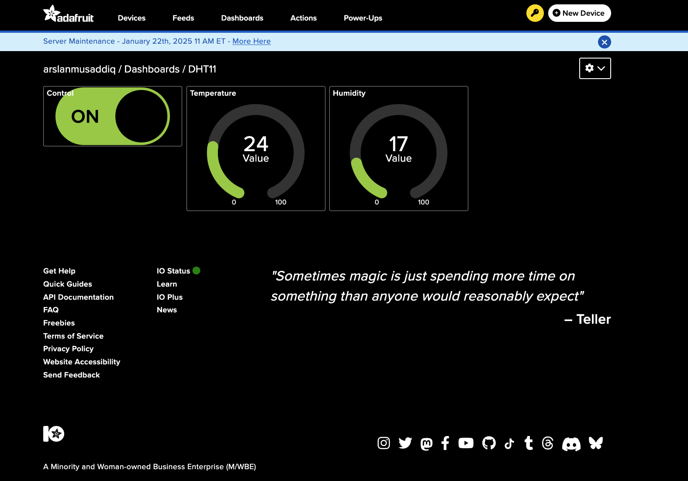

# Lab 2 - Using MQTT for IoT Communication

In this lab, we will learn how to implement MQTT (Message Queuing Telemetry Transport) for communication between IoT devices. MQTT is a lightweight messaging protocol designed for constrained environments like IoT. We will build a simple system where an MQTT broker facilitates communication between clients. Using a Raspberry Pi Pico W connected to a DHT11 temperature and humidity sensor and leds, we will read sensor values and transmit them to the MQTT broker. By the end of this lab, you will have a fundamental understanding of how to use MQTT to send sensor data over a network.

In this lab, we will use Adafruit IO, a cloud-based MQTT broker, to send and receive messages between IoT devices. 

## Objectives

- LED Control via Adafruit IO Dashboard: You will create a "Switch" block on your Adafruit IO dashboard, which will allow you to control the first LED. When the switch is turned on (via the dashboard), the Raspberry Pi Pico W will start sending temperature and humidity data from the DHT11 sensor to the MQTT broker.

- Sensor Data Transmission: When the LED is on, the Raspberry Pi Pico W will send the sensor data to the MQTT broker.

- LED Blinking on Data Transmission: With each time the sensor data is successfully sent, the second LED will blink briefly, indicating that the data transmission has occurred.

- Threshold-based LED Control: The system will monitor the sensor readings and check if they exceed a predefined threshold. If the temperature or humidity goes beyond this threshold, a third LED will turn on. If the values fall below the threshold, this LED will turn off.

## Rules

During this lab, you may discuss with students. You may help other students but you may NOT do all steps for them, or share any code. 

## Materials Needed:

- A computer with access to a code editor (e.g., Thonny).
- Internet connection for accessing MQTT resources. (You might need to use your phone Internet to connect Pico to WiFi)
- Python (for MQTT client-side implementation).
- MQTT Broker (Adafruit IO).
- MQTT Client libraries for Python (e.g., umqtt.simple).
- 3 LEDs.
- DHT11 temperature and humidity sensor.
- Jumper wires and resistors.

# Pre-Lab Setup  

## Create an Adafruit IO Account  

- Go to Adafruit IO and sign up for an account:  
  https://io.adafruit.com/  
- After signing up, you will have access to the dashboard where you can create "feeds" and "dashboards".  

## Create a Feed in Adafruit IO  

- In your Adafruit IO dashboard, create a feed (for example, "temperature") where data will be published.  
- This feed will be used as the topic for MQTT communication.  

## Generate an Adafruit IO Key  

- In your account settings, generate an **Adafruit IO Key**.  
- This key is necessary for authenticating the MQTT client to interact with Adafruit IO.  

## Install MQTT Python Library (umqtt.simple)  

You will need the umqtt.simple Python library to interact with the MQTT broker.

Install the library via the terminal or command prompt with the following command:

bash

pip install umqtt.simple

##  Connect the Hardware

- Connect the DHT11 sensor to your Raspberry Pi Pico W.
- Connect the three LEDs to the microcontroller: one for control, one for sending data, and one for alerting based on thresholds.
- Refer to your microcontroller’s pinout diagram to connect the components.

## Code Components
- Event callback functions for handling asynchronous events.
- Use global variables to manage state.
- Publish and Subscribe mechanisms in MQTT.
- Use timers for scheduling tasks.

 ### Breadboard circuit

Connect the breadboard power-rails to GND and 3V3.

 * GND <--> Black/Blue Power Rail (BPR)
 * 3V3 <--> Red Power Rail (RPR)
 
## Expected output

The program output should look like the following:

You Adafruit dashboard should look like this: 

#### Expected output

## Examination

This assignment should be examined by a teacher/TA. 

Prepare for that by checking yourself so that you know the answers to the following questions:

### LED Control and Dashboard Interaction:
* How does the dashboard control the LED on the Raspberry Pi Pico W?
* What happens when the LED is turned on via the dashboard?
* How does turning on the LED trigger the sending of sensor data?
* What is the purpose of blinking the LED after sending data from the DHT11 sensor?

### DHT11 Sensor Data Transmission:
* How does the DHT11 sensor transmit temperature and humidity data?
* How is the sensor data sent to the MQTT broker?

### MQTT Communication:
* What is the role of the MQTT broker in this setup?
* How does MQTT facilitate communication between the Raspberry Pi Pico W and the dashboard?
* What MQTT topics are used to send and receive data in this lab setup?
* Why is it important to use a delay when handling sensor readings and LED controls?