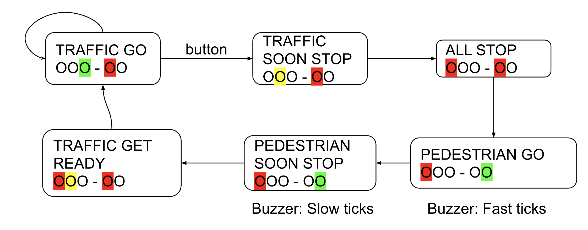

# Lab 2 - The IoT Traffic Light

In this assignment we aim to work with more code and components. We apply the things we have learned so far, more of the same but with less instructions and guidance.

## Rules

The first task is to create a traffic light with buttons, that is not connected to the internet. This task is done individually.

The second task is to create a connected traffic light. This task task is done in groups of TWO students. Both students must be active during all steps of the assignment. You will need to collaborate with one other student and show that your IoT traffic light is communicating over the internet.

ALERT! DURING THIS ASSIGNMENT NONE OF THE ARTIFACTS FROM THIS ASSIGNMENT MAY BE SHARED WITH OTHER STUDENT GROUPS. YOU MAY NOT ASK FOR HELP FROM OTHER STUDENT GROUPS, THINK OF THIS AS AN EXAM. 
YOU MAY GET HELP FROM A TEACHING ASSISTANT OR THE TEACHER.

## Knowledge Components
 * Apply knowledge components from previous assignments. 

## Ingredients

### Hardware
 * Six LED's with resistors (2 x Red, 2 x yellow, 2 x green)
 * Buzzer with resistor
 * Button with resistor
 
## Steps

### Step 1. Build Check all components

We are going to build a traffic light that can sit next to a pedestrian crossing. Thus, it has three LEDs for traffic, two LEDs for the pedestrian crossing, and a button circuit used by pedestrians to ask for green light. 

Build one circuit at a time and test before continuing to the next
* a traffic light (Red, Yellow, Green - LEDs with resistors), 
* a pedestrian crossing light (Red, Green - LEDs with resistors) and a Buzzer
* a pedestrian button (button circuit and Yellow LED with resistors). The LED is ON when the button has been pressed and is turned off when green LED is ON for the pedestrians.

To test all components: 
When all hardware has been set-up, write a routine that waits for a button press, then turn ON each LED, and finally beeps the buzzer before waiting again. Note that all pins cannot be used for output. 

### Step 2. Traffic light with pedestrian crossing

We are now going to model a pedestrian crossing light with Python code. The traffic light is normally Green.
The button should represent a pedestrian looking to cross the street. When pressed, the Yellow button-LED should light up, traffic is given Red light (after a while), and pedestrians should be allowed passage before the traffic light turns Green again.

We can model this by defining different states, each defined in its own function:

#### States:

 * TRAFFIC GO: Traffic Green LED, Pedestrian Red LED, lasts for at minimum of 4 seconds, but continue longer if not interrupted by button presses.
 * TRAFFIC SOON STOP: Traffic Yellow LED, Pedestrian Red LED, lasts 2 seconds
 * ALL STOP: Traffic Red LED, Pedestrian Red LED, lasts 1 second
 * PEDESTRIAN GO: Traffic Red LED, Pedestrian Green LED, Buzzer speedy Tick sounds, lasts 3 seconds
 * PEDESTRIAN SOON STOP: Traffic Red LED, Pedestrian Green LED, Slower Tick Sounds, lasts 1 second
 * TRAFFIC GET READY: Traffic Red LED + Traffic Yellow LED, Pedestrian Red LED, lasts 1 second

 

You can now write a main loop that normally runs the TRAFFIC GO state-function if nothing happens. If the button is pressed a boolean variable is set and the main loops starts calling the different state-methods in order.

#### Check code
 * Code should be DRY (no unnecessary repeated statements)
 * Code should be divided into methods / functions
 * Method names should represent the content (for example state names)
 * Code should be readable and easy to understand
 * Code should be easy to extend
 * Code should be easy to test

**Part 1 is done individually.**

# Part 2 - connection to the internet

The previous tasks has been a single MCU device (on its own) without any communication. In this final part, we connect our MCU to the Internet over the WiFi and push information to an online server.

 * Simple Internet Of Things (IoT) scenario
 * Connect MCU to WiFi
 * Synchronize with the Cloud using MQTT

**Requirement**: The IoT traffic light should be connected to another light, and they should communicate.

This means that your two lights should communicate over the network, if one light is green the other should react accordingly.

## Knowledge Components

 * MQTT wikipedia https://en.wikipedia.org/wiki/MQTT
 * MQTT lib (there are others also) https://github.com/peterhinch/micropython-mqtt

You may use the MQTT server in our own LNU server hosted at Digital Ocean, or `mqtt.iotlab.dev`, the DNS should point to `64.225.110.253`. Note, port 1883 and no encryption (TLS) is needed, username: `king`, password `arthur`.

* Use the MQTT Explorer to visualise and connect to the MQTT-server. [MQTT Explorer](http://mqtt-explorer.com/)

A good introduction to the MQTT protocol and usage is found here: https://youtu.be/3VXDPiDmSog

## Ingredients

### Hardware

- Microcontroller
- LEDs, resistors etc.
 
## Steps

### Step 1. Simple communication from the MCU over WiFi

To be able to communicate to the internet we need a WiFi connection. The amount of data sent is very little. You will need to use a network without a certificate, that means you cannot use EDUROAM. Use the `LNU-iot` LNU network or share your own from your phone. Note that the `LNU-iot` network is capped at 50 kb/s, so you will need to be patient and not send too much data. The password is `modermodemet`.

#### Script

Replace `WIFI_NETWORK_ID` with the sid of your network and `YOUR_WIFI_PASSWORD` with the passkey in the  code and make sure you can connect to your WIFI before continuing. 

Read the documentation on how to connect to WiFi. There are also some good guides on the [internet](https://www.cnx-software.com/2022/07/03/getting-started-with-wifi-on-raspberry-pi-pico-w-board/)

The script should eventually connect to WiFi and show "Connected to WiFi".

### Step 2. Connect to a MQTT server.

Use the LNU MQTT server (mqtt.iotlab.dev:1883). Optional is to use your own hosted local instance or a service online (example HiveMQ, eclipse.org or Adafruit, etc.). You can use any public MQTT server. Preferable you can use our own hosted MQTT server that we are running a VM at Digitalocean, that is running a Mosquitto MQTT. Note, the information will be accessible by all your peers that are using the same server (that applies to all public servers as well).

- `mqtt.iotlab.dev the DNS should point to 64.225.110.253, user=king, pass=arthur, port=1883`

Use the MQTT Explorer to visualise and connect to the MQTT-server. [MQTT Explorer](http://mqtt-explorer.com/)

#### Optional. Run your own MQTT server with Docker

*This setup is optional and considered as an advanced option.* You will need to install Docker.

https://hub.docker.com/_/eclipse-mosquitto

Using Docker locally, default config. Note, this will only be accessible within your own subnet if you don't open up ports in your router.

```bash
docker run -p 1883:1883 eclipse-mosquitto
```

#### Optional. Public Eclipse.org

Eclipse has an open mqtt.eclipse.org server that can be used for testing. Recommended if you just want to play around and see if things work. NOTE, this is open.

#### Optional. Adafruit IO account

Go to https://io.adafruit.com/  and sign up for a free account. Make note of your ADAFRUIT_USER_NAME since you need to use it in the following. When logged in, get the YOUR_AIO_KEY from https://io.adafruit.com/, click on "AIO Key"

 * `ADAFRUIT_USER_NAME`
 * `YOUR_AIO_KEY`

Note that you get the following in a free account.

 * 30 data points per minute
 * 30 days of data storage
 * 10 feeds
 * 5 dashboards

When exceeding the data points, you may get ECONNRESET.

### Step 3. subscription and publishing

Now its time to communicate using a mqtt-library through the WiFi network. First step is to verify that we got communication going in both directions.

Name your device and topic. `YOUR_GROUP/YOUR_DEVICE_NAME`

* Import the mqtt library.


Then combine the following code with the WLAN code. Dont forget to change the needed string constants so that it uses your own account on your mqqt server.

Read the documentation on how to connect to a MQTT. https://github.com/peterhinch/micropython-mqtt/blob/master/mqtt_as/README.md#18-rp2-pico-w

*Note: There are other MQTT libraries available, but this one is popular and well documented. For instance, you can also find a micropython-mqtt lib when searching in the Thonny IDE for packages.*

### Step 4. Resilient connections

We suggest writing your code so that it can reset connections in case of errors. Thus, we want you to be able to be disconnected from both WiFi and the MQTT server and automatically reconnect again.

To accomplish this we suggest writing most of your code inside a while-True loop and have a branching statement (if-elif-else) that directs the application to different actions. 

Consider the following pseudocode:

```
Repeat Forever
 if WIFI is not connected
   connect to wifi
 else if adafruit IO is not connected
   connect to adafruit IO
 else if we have something to "publish"
   publish something
 else
    check for incomming messages from adafruit IO
```

Sometimes things may go wrong, thus, you need to add one or more try-except statements. In the following case, it has only one try-except that catches OSError inside the loop statement:


```python
while True:
    try:
        ... all the if-statements in pseudo code...
    except OSError as er:
        print("failed: " + str(er)) # give us some idea on what went wrong
        client.disconnect() # disconnect from adafruit IO to free resources
        adafruit_connected = False # mark us disconnected so we know that we should connect again 
        
```

## Examination

This assignment should be examined by a teacher/TA. 

Prepare for that by checking yourself so that you know the answers to the following questions:

#### Part 1, indivudual.

 * Does the traffic light work?
 * What happens if you press the button repeatedly?
 * Why should we keep the code in event-callbacks to a minimum?
 * How is the event-callback handled?
 * The time for key-presses should be printed as the example.

#### Part 2, group (with one or more persons)

* Explain how the traffic lights function, and how they communicate.
* How do you utilise the MQTT interrupt?
* What happens if the device loses connection to the MQTT server?
* What happens if the MQTT server is down?
* What is synchronised between the MQTT server and the device?
* Code should be DRY (no unnecessary repeated statements)
* Code should be divided into methods
* The song should not be played in the eventhandler function but started in a separate loop (or thread).
 
### Check knowledge: 
 * Ask the group members individually two questions each of the above questions.

When completed you should ask a teacher/TA to check your setup and verify the questions above yourself.
