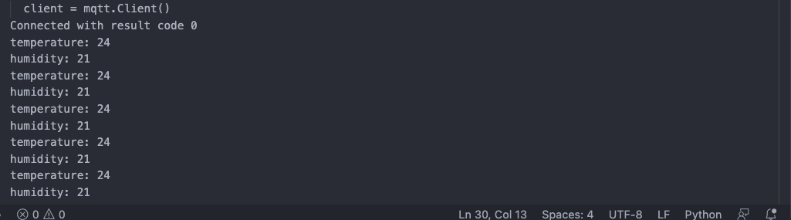
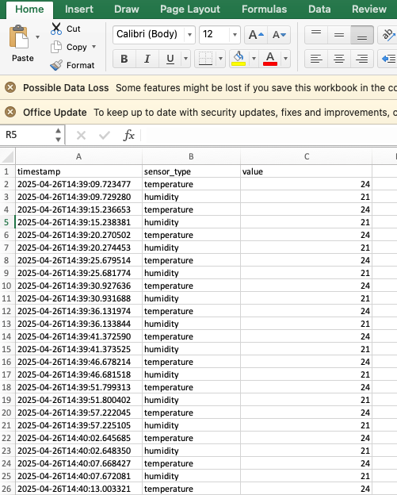
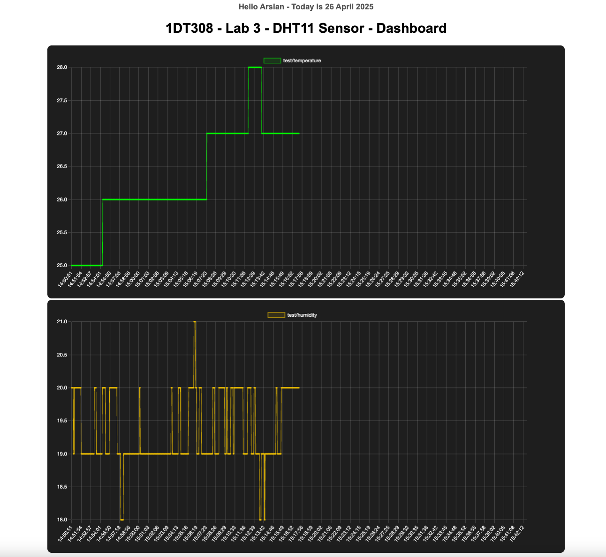

# Lab 3 - Build Your Own IoT Dashboard and Logger

In this lab, you will create your own custom IoT dashboard and data logger system by integrating an MQTT broker, a Python MQTT client, and a simple web server.


You will collect, store, and visualize IoT sensor data from a Raspberry Pi Pico W using MQTT, CSV logging, and a Flask-based web dashboard.

Flask is a lightweight web framework for Python that allows you to build simple websites, web apps, and dashboards. It helps you easily create web servers that can display data, handle user input, and connect to databases or IoT devices. 

## Objectives

- Build a Python MQTT subscriber that saves incoming data to a CSV file.
- Build a Flask web application to visualize stored data.
- Stream live sensor values (Temperature & Humidity) to your web dashboard.

## Overview

The Raspberry Pi Pico W will publish sensor data (temperature and humidity) to an MQTT broker (Mosquitto).
A Python script will subscribe to these topics, log the data into a CSV file, and serve the data via a Flask web application with basic visualizations.

# Step 1: Set Up MQTT Broker (Mosquitto)

You should already have Mosquitto installed from Lab 2. If not, review Step 1 from Lab 2 to install and run Mosquitto on your machine.

start Mosquitto if installed:

```bash
brew services start mosquitto
```

# Step 2: Publish data from Pico to Mosquitto 

Use the same publishing code as in Lab 2, sending temperature and humidity readings to the following topics:
```bash
test/temperature
test/humidity
```

Make sure your Pico W is connected to the same network as your laptop. 

# Step 3: Create Python MQTT Subscriber and Logger, and Dashboard

Now, write a Python script that listens to the MQTT topics and logs the received data into a CSV file.

##  Install Required Python Packages (if not done already)

In your terminal or VSCode terminal:

```bash
pip install paho-mqtt
```
## Write Python script that listens to the MQTT topics

Write a Python script that listens to the MQTT topics and logs the received data into a CSV file.

In your script, you will need to give MQTT broker address. In this case, you are running Mosquitto on your laptop so you will need to use your laptop IP address. 

If your script is working fine, you will see an output like this: 



And you will see timestamp values in CSV file like this:




## Build a Flask Web Dashboard

Now next step is to create a simple web dashboard that reads from the CSV file and shows the data.

## Create your webpage template 

Create a templates folder in the same directory and inside it, create index.html.

Make a fun dashboard as you like. 


In Terminal 1, run your subscriber:

For example, 

```bash
python3 MQTT-Subscriber.py

```
In Terminal 2, run your dashboard:


```bash
python3 dashboard.py

```
Visit http://localhost:5000 in your browser and see your own live IoT dashboard. :) 


For example, this is what I made: 




# Examination

If you have done this lab correcly, you should be able to answer the following questions: 

This lab will be examined by a teacher/TA.  

### MQTT Setup and Data Logging:
- How does the Python MQTT subscriber script function to receive data from the MQTT broker?
- How can you verify that the data is being correctly logged into the CSV file?

### Flask Web Dashboard:
- How does Flask handle real-time data on the web dashboard in this lab?
- How does the Flask application fetch and display temperature and humidity data from the CSV file on the dashboard?

### Data Storage:
- What are the benefits and limitations of storing sensor data in a CSV file versus a database (like InfluxDB or SQLite)?
- How could you extend this project to use a database for data storage instead of a CSV file?
