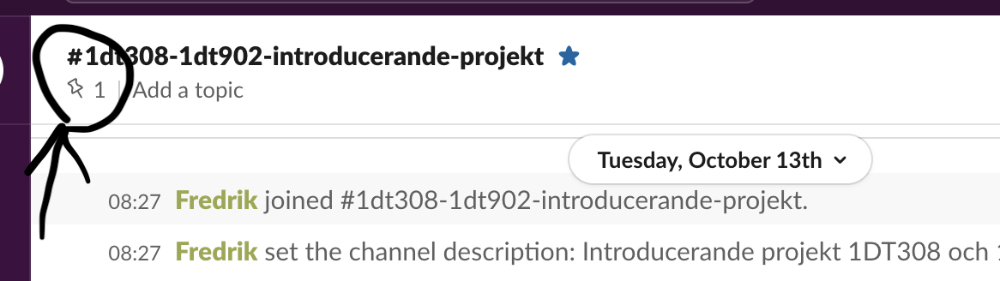
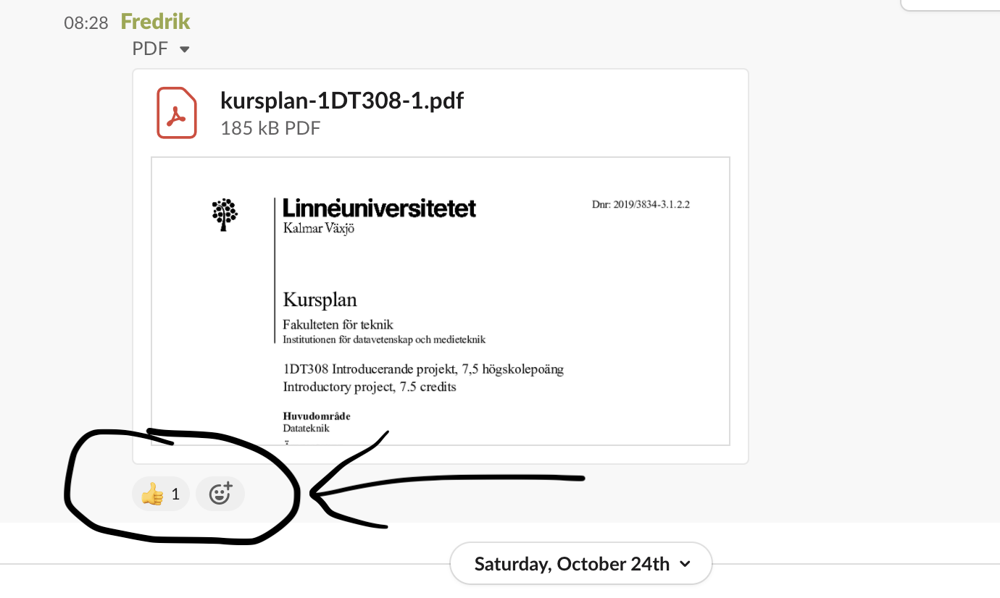
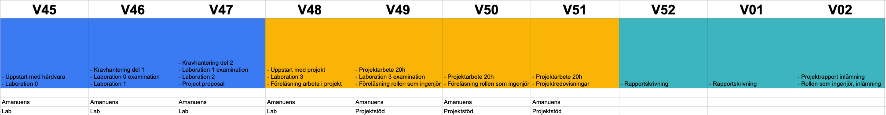

# Study guide 1DT308

## important links

- [Moodle](https://moodle.lnu.se/course/view.php?id=68072)
- [Kursplan 1DT308](https://kursplan.lnu.se/kursplaner/kursplan-1DT308-1.pdf)
- [Gitlab](https://gitlab.lnu.se/1dt308/content)
- [Slack kanal](https://coursepress.slack.com/signup) **#1dt308-introducerande-projekt**
- [Project template](project-template.md)

## Expectations

- Read this document **carefully**. Feedback with comments directly if there is anything that is unclear.
- Plan your studies. Add time in your calendar to work on assignments outside of scheduled time, attendance is required to complete assignments.
- Feel free to ask your questions early if something is unclear, don't wait. Start assignments well in advance, otherwise there is very little time to help.
- **Interact with students and teachers on Slack**. Ask, and don't be afraid to answer questions from other students. Remember - be nice and respectful. The success of the course is based on your participation.
- Above all - try to adopt a positive attitude and **have fun.**

## Lectures and labs

- All lectures will be held online, with either a pre-recorded link or a live stream provided.
	- Feel free to ask questions via **Slack**.
- The lectures will be updated via TimeEdit.
- LLaboratory sessions will be led by teacher and TAs on campus. See schedule.
- Laboratory sessions do NOT have a mandatory attendance requirement, however, you are required to demonstrate that you have completed each session. That is, it is largely a requirement to be on site if you are going to complete the course.
- In order for you to have a chance to complete all laboratory sessions on time, you must be on site on campus. The laboratory sessions are of increasing scale and quickly become more complex.

## Participation

- During the initial weeks, laboratory exercises 0-4 must be reported to a teacher or amanuensis. The laboratory exercises are done individually, but it is expected that you will nevertheless cooperate and help each other. To pass the course, you must complete all required lab sessions (0–4). 
- If you complete all required lab sessions (0–4) and pass the oral exam, you will receive a maximum of C grade.

## Oral exam

**Exam format.**

- The exam will be an oral exam of approximately 10-15 minutes (extended time can be provided if needed).
- It will be conducted online via Slack.
- The exam will consist of 5 questions based on the course material.
- To pass, you need to answer at least 3 questions correctly.
- If you feel unsure about a question, you may ask to skip to the next one to maximize your time.
- You must bring your ID card, and your eyes must remain focused on the camera.
- The exam will take place during week 22, and there will be two separate sessions for the oral exam. 
- You can register for the exam during week 20-21.

## Higher Grades (B or A)

To aim for a higher grade (B or A), you must build upon the knowledge gained from lab sessions 0–4 and develop your own project. This is an open-ended task, but some guidelines are provided below.

## Project Guidelines
- You may work alone or in pairs. If working in a pair, the expectations for the project will be higher.
- You may use any embedded board or microcontroller of your choice.
- You may use any programming language.
- You may incorporate code/libraries found online, provided the licensing allows it and you properly document their use. However, your project must include original code developed by your group; simply combining existing code is not sufficient.
- Your project may complement work done in another course, but it must be a new implementation. You cannot submit previously completed work.

Present and discuss your project with a teacher or Teaching Assistant no later than three weeks after the course starts. Discussions take place during lab sessions. 

## Grades distributions

**Grade F.**

A Grade F requires a retaking of the course and could look like this:

- Incomplete lab sessions 0-4: Significant portions of the labs 0-4 are incomplete or missing. 
- Fail to Pass oral exam. 

**Grade E.**

- Complete the labs 0-4: Finish most parts of these labs, though some minor aspects may be incomplete.
- Pass oral exam. 

**Grade D.**

- Complete the labs 0-4: Finish all parts of these labs.
- Pass oral exam.

**Grade C.**

- Complete the labs 0-4: Finish all parts of these labs.
- Implement at least 1-2 additional sensors beyond DHT11.
- Pass oral exam. 

## Course objectives

**The course has two tracks.**

- The first track presents a single-chip computer and how to write programs that interact with external devices such as sensors and networked devices.
- The second track introduces how to work in projects and groups, as well as the professional role of engineer.

[Kursplan 1DT308](https://kursplan.lnu.se/kursplaner/kursplan-1DT308-1.pdf), [Kursplan 1DT902](https://kursplan.lnu.se/kursplaner/kursplan-1DT902-1.pdf)

**Kunskap och förståelse**:
A.1 förklara hur systemkrav tas fram, specificeras och testas,
A.2 översiktligt redogöra för vad projektledning och kvalitetsarbete innebär i praktiken, samt
A.3 redogöra för mjukvaruindustrins olika sektorer och olika arbetsuppgifter.

**Färdighet och förmåga**:
B.1 utveckla program för en enchipsdator (microcontroller) med externa enheter, såsom sensorer, och nätverkskoppling,
B.2 analysera ett problem, skapa en kravspecifikation, designa och implementera lösningar, och verifiera att lösningen uppfyller alla krav,
B.3 använda vanliga tekniska projektverktyg (såsom versionshantering med Git), l B.4 självständigt söka efter och värdera information om hårdvara och hur man löser programmeringsproblem,
B.5 strukturera och genomföra en skriftlig och muntlig presentation av genomfört projekt, samt
B.6 genomföra ett projekt i grupp under begränsad tid och där tillämpa en arbetsform som presenterats i kursen.

**Värderingsförmåga och förhållningssätt**:
C.1 reflektera över och värdera en given ansats att lösa ett problem,
C.2 reflektera över relationen mellan ämneskunskap, ingenjörsfärdigheter och yrkesrollen ingenjör, samt
C.3 reflektera över och värdera sin egen kontra gruppens insats vid laborations­ och projektarbete.

**Innehåll:**

- Introduktion till en enchipsdator (hårdvara och mjukvara).
- Implementera och exekvera program i Python på en enchipsdator.
- Interagera med externa enheter (såsom sensorer och nätverkskopplade enheter).
- Fördjupning av labbmiljön.
- Introduktion till kravhantering, mjukvarudesign och testning.
- Introduktion av verktyg och metoder som används inom ett projekt såsom versionshantering, kravhantering, och kommunikation.
- Introduktion till projektmetodik och projektdynamik.
- Hur man arbetar i grupp, vilka roller som finns, vilket ansvar individen har, osv.
- Hur man söker efter information om mjukvaruutvecklings problem, såsom APIer, hårdvaruspecifikationer och lösningar till problem som uppstår. l Hur man skriver enklare projektdokumentation.
- Muntlig och skriftlig presentation av tekniskt material.
- Ingenjörens yrkesroll, arbetsuppgifter och förhållningssätt.
- Ingenjörens ansvar och arbetsmiljö.

## Kommunikationsstrategi

- *Personliga* frågor gällande formella medverkan på kursen, frånvaro, betyg skickas via email till ansvarig lärare. OBS, undvik gärna direktkommunikation till lärare gällande frågor som rör kursens innehåll, sannolikt är det någon annan som har samma fråga och det ställs då i ett öppet forum i kursens Slack-kanal.
- Frågor kring kursen, uppgifter, examination, schema, ställs i Slack **#1dt308-1dt902-introducerande-projekt**.
- Information gällande kursen kommer postas på Slack. Det är _viktigt_ att du läser allt som är '*Pinned*'.
- Reagera till **alla** '*Pinned posts*' på Slack.
- Ni kan filtrera alla '*Pinned posts*' enligt figur nedan.

## Deadlines

Kursen börjar **måndagen den 7:e november 2022** och slutar **fredagen den 13:e januari 2023**.

Varje lab presenteras senast kommande labtillfälle veckan efter genomgången lab. Det går att genomföra laborationerna i snabbare tak

- **V46**: Lab 0, U/G.
- **V47**: Lab 1, U/G.
- **V48**: Lab 2, U/G.
- **V49**: Lab 3, U/G.

Deadlines för projekt.

- **Fredag 25:e nov**: Inlämning av projektplan och gruppindelning.
- **Tisdag-Onsdag 21-22 december**: Projektredovisningar
- **Lördag 14: januari**: Deadline för projektrapport och video, GitLab. A-F
- **Lördag 14: januari**: Inlämning rapport på MyMoodle, ingenjörens roll, U/G.

Samtliga moment ska vara genomförda innan kursens slut för ett betyg.

## Examination

| Benämning | Betygsskala | Poäng |
| --- | --- | --- |
|  Programmeringsuppgifter  | U/G | 2 |
| Projekt (inkl. leverabler) | A-F | 4 |
| Presentation | A-F | 0.5 |
| Uppgifter om yrkesrollen ingenjör | U/G | 1 |

- [Uppgifter om yrkesrollen ingenjör](ingenjor.md)
- [Projektarbetet](project-template.md) görs i rapportform, och läggs upp i en `README.md` i ert GitLab repository.

---

**OBS! Om ni önskar ett högre betyg än C** måste ni presentera och diskutera ert projekt med lärare, samt anmäla intresse för högre betyg.

## Planering

Kursen är tio veckor lång, varav de fyra första veckorna innehåller mer grundläggande föreläsningar och laborationer för att komma igång med hårdvara. 

### Öppna videos:

- Samtliga föreläsningar kommer annonseras på Slack.
- Vi kommer att publicera alla öppna inspelningar via [Youtube Computer Science](https://www.youtube.com/cslnu), följ gärna den.

- Docker and TIG-stack: https://youtu.be/unSuncsrPLA
- Let's go far with LoRa: https://youtu.be/Wbas04ouRdk
- IoT and connectivity: https://youtu.be/uUVKWt4NKUo
- MQTT: https://youtu.be/3VXDPiDmSog

### Ej öppna föreläsningar

- Eventuella föreläsningar som ej kommer spelas in öppet kommer att publiceras i Slack samt på MyMoodle. 