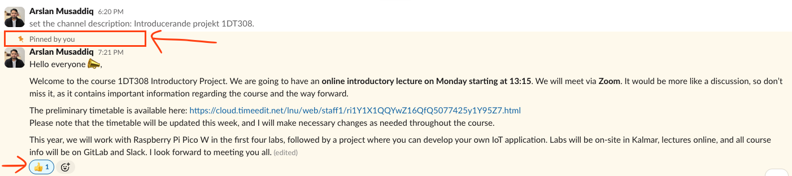

# Study guide 1DT308

## important links

- [Moodle](https://moodle.lnu.se/course/view.php?id=68072)
- [Kursplan 1DT308](https://kursplan.lnu.se/kursplaner/syllabus-1DT308-1.pdf)
- [Gitlab](https://gitlab.lnu.se/1dt308/content)
- [Slack kanal](https://coursepress.slack.com/signup) **#1dt308-1dt902-introducerande-projekt**
- [Project template](project-template.md)
- [Timetable (preliminary)](https://cloud.timeedit.net/lnu/web/staff1/ri1Y1X1QQYwZ16QfQ5077425y1Y95Z7.html)

## Expectations

- Read this document **carefully**. Feedback with comments directly if there is anything that is unclear.
- Plan your studies. Add time in your calendar to work on assignments outside of scheduled time.
- Feel free to ask your questions early if something is unclear, don't wait. Start assignments well in advance, otherwise there is very little time to help.
- **Interact with students and teachers on Slack**. Ask, and don't be afraid to answer questions from other students. Remember - be nice and respectful. The success of the course is based on your participation.
- Above all - try to adopt a positive attitude and **have fun.**

## Lectures and labs

- All lectures will be held online, with either a pre-recorded link or a live stream via Zoom or other platforms provided.
	- Feel free to ask questions via **Slack**.
- The lectures will be updated via TimeEdit.
- Laboratory sessions will be led by teacher and TAs on campus. See schedule.
- Laboratory sessions do NOT have a mandatory attendance requirement, however, you are required to demonstrate that you have completed each session. That is, it is largely a requirement to be on site if you are going to complete the course.
- In order for you to have a chance to complete all laboratory sessions on time, you must be on site on campus. The laboratory sessions are of increasing scale and quickly become more complex.

## Participation

- During the initial weeks, laboratory exercises 1-4 must be reported to a teacher or TAs. The laboratory exercises are done individually, but it is expected that you will nevertheless cooperate and help each other. To pass the course, you must complete all required lab sessions (0–3). 
- If you complete all required lab sessions (0–3) and pass the oral exam, you will receive a maximum of C grade.

## Oral exam

**Exam format.**

- The exam will be an oral exam of approximately 10-15 minutes (extended time can be provided if needed).
- It will be conducted online via Slack or onsite in Kalmar campus.
- The exam will consist of 5 questions based on the 1-4 labs and course material. 
- To pass, you need to answer at least 3 questions correctly.
- If you feel unsure about a question, you may ask to skip to the next one to maximize your time.
- The exam will take place during week 22, and there will be two separate sessions for the oral exam. 
- You can register for the exam during week 20-21.

The oral exam will be similar to an informal presentation, where I want you to explain what you have learned from the labs and the course materials. 

## Grades distributions

**Grade F.**

A Grade F requires a retaking of the course and could look like this:

- Incomplete lab sessions 1-4: Significant portions of the labs 0-3 are incomplete or missing. 
- Fail to Pass oral exam. 

**Grade E.**

- Complete the labs 0-3: Finish most parts of these labs, though some minor aspects may be incomplete.
- Pass oral exam. 

**Grade D.**

- Complete the labs 0-3: Finish all parts of these labs.
- Pass oral exam.

**Grade C.**

- Complete the labs 0-3: Finish all parts of these labs.
- Increase your project complexity little bit by adding additional components, e.g., another sensor or features. 
- Pass oral exam. 

## Higher Grades (B or A)

To aim for a higher grade (B or A), you must build upon the knowledge gained from lab sessions 1–4 and develop your own project. This is an open-ended task, but some guidelines are provided below.

## Project Guidelines
- You may work alone or in pairs. If working in a pair, the expectations for the project will be higher.
- You may use any embedded board or microcontroller of your choice.
- You may use any programming language.
- You may incorporate code/libraries found online, provided the licensing allows it and you properly document their use. However, your project must include original code developed by your group; simply combining existing code is not sufficient.
- Your project may complement work done in another course, but it must be a new implementation. You cannot submit previously completed work.

Present and discuss your project with a teacher or TAs no later than three weeks after the course starts. Discussions take place during lab sessions. 

At the end of the project, you are expected to present or demonstrate it either online or on-site in Kalmar (record a video as a backup) and submit a report that details your project’s design, implementation, challenges faced, and results. 

## Course objectives

**The course has two tracks.**

- The first track presents a single-chip computer and how to write programs that interact with external devices such as sensors and networked devices. In addition, develop skills in creating dashboards and visualizing sensor data.
- The second track introduces how to work in projects and groups, as well as the professional role of engineer.

[Kursplan 1DT308](https://kursplan.lnu.se/kursplaner/syllabus-1DT308-1.pdf)

**Knowledge and understanding**
A.1 Explain how system requirements are developed, specified, and tested•
A.2 Give an overview of project management methods•
A.3 Describe the different sectors of the software industry and related work tasks•

**Competence and skills**:
B.1 Develop software for an embedded computer (microcontroller) with external sensors and network connection
B.2 Analyze a problem and create a requirements specification; from this, be able to implement a solution and verify that it fulfills the requirements
B.3 Be able to use standard engineering tools, such as version control with Git
B.4 Independently search and evaluate information about hardware and programming problem
B.5 B.5 Be able to structure a written report as well as an oral presentation of a completed project
B.6 Carry out a project in a group within a limited time frame during the course

**Judgement and approach**:
C.1 Reflect and evaluate a given approach to solve a problem•
C.2 Reflect on the relationship between engineering knowledge, engineering skills, and the professional role of an engineer
C.3 Reflect on and evaluate their role versus the group effort in projects and assignments

**Content:**

- Introduction to a microcontroller (hardware and software)•
- Implement and execute programs in Python on a microcontroller•
- Interact with external devices, such as sensors, buttons, and networked devices•
- Introduction to project requirements, software design, and testing•
- Introduction to engineering tools and methods, such as version control, requirements management, and communication
- Introduction to project management•
- How to work in a group, the different roles with responsibilities•
- How to search for information about software related issues, such as API, hardware specifications, and solutions
- How to write a fundamental project documentation•
- Oral and written presentation of technical material•
- An engineer’s professional role in the work-life, typical tasks, and responsibilities

## Type of Instruction

- *Personal* questions regarding formal participation in the course, absences, grades are sent via email to the responsible teacher. NOTE, please avoid direct communication with teachers regarding questions regarding the course content, it is likely that someone else has the same question and it is then asked in an open forum in the course's Slack channel.
- Questions about the course, assignments, examination, schedule, are asked in Slack **#1dt308-introductory-project**.
- Information regarding the course will be posted on Slack. It is _important_ that you read everything that is '*Pinned*'.
- React to **all** '*Pinned posts*' on Slack.
- You can filter all '*Pinned posts*' according to the figure below.

## Deadlines

The course begins **Monday, March 31, 2025** and ends **Thursday, June 05, 2025**.

Each lab is presented at the latest at the next lab opportunity the week after the lab was completed. It is possible to complete the lab exercises more quickly

- **V15**: Lab 1, U/G.
- **V16**: Lab 2, U/G.
- **V17**: Lab 3, U/G.
- **V18**: Lab 4, U/G.

Deadlines for projects.

- **Friday 5th May**: Submission of project plan and group assignment.
- **Monday-Tuesday 26-27 May**: Project reports
- **Monday-Tuesday 4-5 June**: Final Deadline for project report and video. 

All elements must be completed before the end of the course for a grade.

## Examination

| Benämning | Betygsskala | Poäng |
| --- | --- | --- |
|  Programmeringsuppgifter  | U/G | 2 |
| Projekt (inkl. leverabler) | A-F | 4 |
| Presentation | A-F | 0.5 |
<!-- | Uppgifter om yrkesrollen ingenjör | U/G | 1 |-->

<!-- [Uppgifter om yrkesrollen ingenjör](ingenjor.md)-->

- [The project work](project-template.md) is done in report form, and is posted in a `README.md` in your GitLab repository.

**NOTE! If you wish to receive a grade higher than C**, you must present and discuss your project with your teacher, and register your interest in a higher grade.

## Planning

The course is ten weeks long, of which the first four weeks contain more basic lectures and labs to get started with hardware.

### Open videos:

- All lectures will be announced on Slack.
- If there are vidoes, we will publish all open recordings via [Youtube Computer Science](https://www.youtube.com/cslnu), please follow it.

### Vidoes from previous year:

- Docker and TIG-stack: https://youtu.be/unSuncsrPLA
- Let's go far with LoRa: https://youtu.be/Wbas04ouRdk
- IoT and connectivity: https://youtu.be/uUVKWt4NKUo
- MQTT: https://youtu.be/3VXDPiDmSog

### Non-open lectures

- Any lectures that will not be recorded openly will be published in Slack and on MyMoodle.